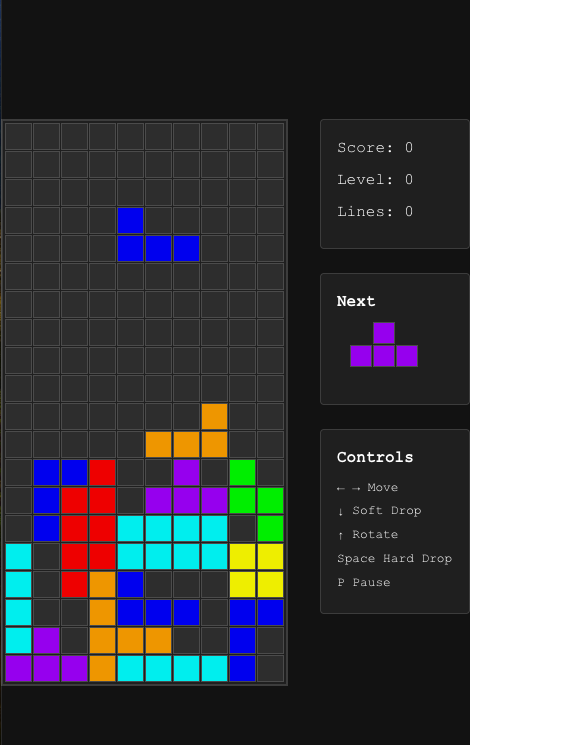

# with-claude

以下の記事を参考に、Claude Codeを使ってみます。

[Claude Pro（$20）プランでゼロから始めるClaude Code](https://zenn.dev/asap/articles/700168965fdb7b)

このプロジェクトでは、記事と同様にテトリスを作ってもらうことにします。使い慣れているReact + TypeScriptで作ってもらおうと思います。

## コマンドやプロンプトのメモ

### テトリスが完成するまで

```bash
claude "/init"
> テトリスをReact + TypeScript + Viteで作成してください。
```

- create vite
- npm install

とりあえずここでプロジェクトの初期化は完了。テトリスのロジックはわからんけどなんかやってくれてるみたいなのでとりあえずOKしていく。

typeじゃなくてinterfaceを使っていたり、function宣言じゃなくてアロー関数を使っているのは好みじゃないかもしれない。些細なことなのでとりあえずOKする。

2番のauto-acceptを選んであとは勝手にやってもらうことにした。実際にブラウザを立ち上げて確認したりしているらしい？一緒にブラウザ起動して確かめてみようかな。

編集したファイルを見てみた。trailng spaceがあったりするのでフォーマッタにかけたい。ここら辺も設定ファイルに書いておいておいた方が良さそう。あとソフトウェア開発のプラクティスは、僕がちゃんと勉強して把握しておく必要がある。最低限とフォーマット、テスト、リント、CIあたりはやる。

localhost:5174で起動してるって言ってるんだけど、起動してなさそうだった。もう一度確認するとnpm run devしてくれてるっぽいが、なんでそれだけで時間かかってるんだろう？

アクセスできないので、自分で起動してやってみることにする。エラーが出ているっぽい。

```bash
> 次のエラーを解決してください。tetris.ts:2 Uncaught SyntaxError: The requested module '/src/types/tetris.ts' does not provide
   an export named 'Board' (at tetris.ts:2:3)
```



なんかできた。

### 今回はやらないけどやりたいこと

- 記事に書かれているような、Playwright MCPを使ってテストしてもらうやつ
- Linter、Formatterを入れる（Biomeでいいだろうか）
- テストを書く
